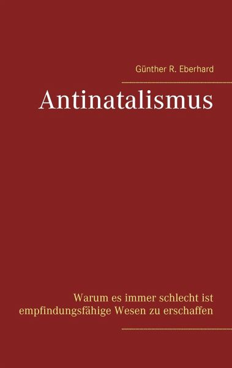

+++
menus = 'main'
title = 'Antinatalismus-Ressourcen'
weight = 2
type = 'docs'
+++

# Antinatalismus-Ressourcen

Hier sammeln wir Ressourcen, die sich mit Antinatalismus beschäftigen.

## Buch: "Antinatalismus" von Günther R. Eberhard

[Antinatalismus - Warum es immer schlecht ist empfindungsfähige Wesen zu erschaffen](https://www.buecher.de/artikel/buch/antinatalismus/48163075/),
mit Leseprobe

"Die Existenz von Leid setzt die Existenz von empfindungsfähigen Lebewesen voraus.
Will man Leiden verhindern, dann muss man Leben verhindern!

Diese unkonventionelle Ansicht versucht der Autor dieses Buches zu verteidigen.

Untersucht werden verschiedene Ansätze und Themen, wie zum Beispiel:
"Ist alles Leben notwendigerweise leidvoll?", "Ist es immer besser, nicht zu sein?",
"Negativer Utilitarismus", "Recht auf Reproduktion"."

## YouTube-Kanal: tofudog 🇬🇧

[YouTube-Kanal von **tofudog**](https://www.youtube.com/@tofudog4u):
    "The **vegan antinatalist variety channel**. Here, we do a little bit of everything- as long as it's vegan."

"Book Review | **Anti-Natalism: Rejectionist Philosophy From Buddhism to Benatar by Ken Coates**":



"Talking to a Student About Antinatalism (Is it Wrong to Create New People?) | **Antinatalist Outreach**": ...

## Buch: "Better Never to have been" von David Benatar, 2006 🇬🇧

[Better Never to have been: The Harm of Coming into Existence](https://www.goodreads.com/book/show/660518.Better_Never_to_Have_Been)

"Better Never to Have Been argues for a number of related, highly provocative, views:

(1) Coming into existence is always a serious harm.

(2) It is always wrong to have children.

(3) It is wrong not to abort fetuses at the earlier stages of gestation.

(4) It would be better if, as a result of there being no new people, humanity became extinct.

These views may sound unbelievable--but anyone who reads Benatar will be obliged to take them seriously."

## Weitere Webseiten, Social-Media-Kanäle

(🚶) Diese Webseite: [Antinatalismus Jetzt.](https://antinatalismus-jetzt.de/) :-)

### YouTube-Kanal: Lawrence Anton 🇬🇧

(🚶) [YouTube-Kanal **Lawrence Anton**](https://www.youtube.com/@LawrenceAnton) -
    ausführliche Interviews; Einordnung des aktuellen Geschehens rund um Antinatalismus

### Positive Antinatalists Facebook-Gruppe 🇬🇧

(🚶) [**Positive Antinatalists** Facebook-Gruppe](https://www.facebook.com/groups/183599152661545/),
    "This group is for Antinatalists who want to encourage the positive side of their life among a community full of encouragement and positivity.

The average Antinatalist is a sensitive soul. A soul that feels so much empathy and wants to save others from inevitable suffering.
While we are empathetic souls, we struggle to feel positive in such a world.
Having observed others I’ve realised having thick skin and better ability to ignore/live on surface of things definitely leads to better ability to combat this war.
So to my friends. Live your life to the fullest of its potential. Antinatalism is the truth however Negativity is not."

### Ressourcen mit weniger stringenter ethischer Argumentation

* Webseite: (🧑‍🤝‍🧑, 🇬🇧) https://www.vhemt.org - **The Voluntary Human Extinction Movement**

* Webseite: (🧑‍🤝‍🧑) https://www.vhemt.org/dindex.htm - deutsche Übersetzung für die Voluntary Human Extinction Movement

* Webseite: (🌐, 👌, 🧑‍🤝‍🧑, 🚶, 🇬🇧) https://www.stophavingkids.org/ - Stop Having Kids

* Artikel: (🚶) ["Wer nicht geboren wird, hat keine Probleme"](https://www.zeit.de/kultur/2018-04/antinatalismus-theophile-de-giraud-bevoelkerungswachstum-feminismus),
    zeit.de, 2018, Tobias Haberkorn,
    "Eine Welt ohne Menschen wäre besser:
    **Der Antinatalist Théophile de Giraud ist gegen das Leben an sich, meint das aber nicht persönlich**.
    Hat er vielleicht sogar recht?"

* Artikel: (🌐) ["Kinderfrei leben - »Reproduktion erzeugt neue Lohnsklaven«"](https://www.jungewelt.de/artikel/469607.kinderfrei-leben-reproduktion-erzeugt-neue-lohnsklaven.html),
    jungewelt.de, 2024, Barbara Eder,
    "Das Buch »Kinderfreie aller Länder, vereinigt euch!« argumentiert für eine Existenz ohne Nachwuchs. Ein Gespräch mit **Verena Brunschweiger**",
    mit **feministischer Perspektive**

* Artikel: (🧑‍🤝‍🧑) ["Griffin verzichtet auf Kinder, um die Erde zu schützen"](https://www.jetzt.de/kinderkriegen-kolumne/antinatalismus-keine-kinder-fuer-den-klimaschutz),
    jetzt.de, 2019, Franziska Koohestani

## Legende

Wir unterscheiden vier Kategorien:

* (🚶, Ethik_I) Ethik mit Fokus auf das **Individuum**, das durch seine Zeugung Leid erfahren würde.
* (🧑‍🤝‍🧑, Ethik_K) Ethik mit Fokus auf die negative Auswirkung, die ein neuer Mensch einzeln oder **kollektiv** auf **andere** hat,
    z. B. als Teil der Menschheit, die Umweltprobleme verursacht und dadurch anderen (und auch sich selber) schadet
* (🌐, Politisch) Mischung aus Ethik_I und Ethik_K mit politischer Motivation, z. B. aus einer feministischen Haltung heraus
* (👌, Persönlich) Kinderlos oder "kinderfrei" aus persönlichen Gründen;
    ein erfülltes Leben zu führen ist möglich, auch ohne sich fortzupflanzen;
    und vor allem ohne, dass einem jemand dabei reinredet.

Englischsprachige Ressourcen sind mit "🇬🇧" gekennzeichnet.

## Unsortiert

* Webseite: https://www.pro-iure-animalis.de/index.php/antinatalismus/articles/was-ist-antinatalismus.html

* Webseite: https://albatros-buch.de/shop/item/9783346771261/antinatalismus-im-lichte-des-klimawandels-von-clara-kongeter-kartoniertes-buch

* Webseite: https://literaturkritik.de/antinatalismus-natuerliche-verbuendete,25592.html

* Artikel: https://berlinergazette.de/de/anti-natalismus/

* Artikel: https://www.rnd.de/medien/kein-kinderwunsch-ard-reportage-zur-antinatalisten-bewegung-JHHFUE73BRCLDNU6XRJQNCZHDA.html

* Artikel: https://www.quint-online.ch/ethischer-antinatalismus-philosophische-motive-nataler-enthaltsamkeit/
