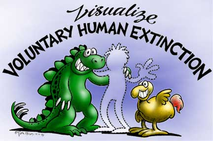

+++
menus = 'main'
title = 'Häufige Fragen (FAQ)'
weight = 22
+++

# Häufige Fragen

## Eltern und Wunsch nach eigenen Kindern

### 🔹 Sollen Eltern mit selbst gezeugten Kindern ihre Entscheidung bedauern?

Auch wenn wir glauben, dass es die moralisch bessere Entscheidung ist, keine Kinder zu zeugen,
soll es Eltern mit selbst gezeugten Kindern nicht schwerer gemacht werden, als es ohnehin schon ist.

Die Entscheidung wurde in der Vergangenheit getroffen und lässt sich nicht rückgängig machen.
Also macht es keinen Sinn sich im Nachhinein darüber zu ärgern, sondern nach vorne zu blicken.
Daher wünschen wir den Eltern alles Gute, um die besten Eltern zu sein, die sich ihr Kind wünschen kann.

Wir begrüßen es, wenn die [antinatalistischen Argumente](../antinatalistische-argumente)
in zukünftige Fortpflanzungsentscheidungen einfließen werden
und die Argumente an andere Menschen weitergegeben werden. 🙂

Auch Eltern von selbst gezeugten Kindern können Antinatalisten sein,
wenn sie erst später davon erfahren haben.

### 🔹 Ich möchte gerne eine Familie haben und Kinder erziehen.

Wenn eine eigene Familie und Kindererziehung gewünscht ist, dann ist
die **Adoption** ([Websuche](https://www.qwant.com/?q=adoption+in+deutschland&t=web))
von bereits vorhandenen Kindern ein möglicher - wenn auch schwierigerer - Weg,
dies ohne eigene Fortpflanzung zu erreichen.

### 🔹 Was ist bedeutet "zeugungsbedingte Selbstkorrumpierung"?

...im Aufbau...



[zu den Ressourcen]()

## Aussterben {#a__aussterben}

(Grafik von [Nina Paley](https://blog.ninapaley.com/), koloriert von Aaron Hackmann)

* [Online-Buch: “Antinatalism, Extinction, and the End of Procreative Self-Corruption”, 2024]()

* Eine freundliche Perspektive auf das Aussterben: [VHEMT: “Mögen wir lange leben und aussterben”](https://www.vhemt.org/dindex.htm)

* ...im Aufbau...

## Gesellschaft

### 🔹 Wer bezahlt meine Rente, wenn es immer weniger Kinder gibt?

Die Sparkassenwerbung aus dem Jahr 1998 sagt prägnant, was davon zu halten ist:



Nämlich, dass Kinder nicht Mittel zu einem (eigennützigen) Zweck sein sollen.

Die Menschen sind kreativ und wenn genug Menschen die Idee der freiwilligen Kinderlosigkeit
übernehmen, so dass praktische Auswirkungen absehbar sind, werden Lösungen gefunden werden.

### 🔹 Wer unterstützt mich, wenn ich schwer krank werden sollte?

* Kinder sind kein Mittel zum Zweck.
* Außerdem sind eigens gezeugte Kinder keine Garantie,
    dass sie sich im Fall der Fälle um einen kümmern werden oder können.

### 🔹 Seid ihr für Abtreibung?

* Das Thema [Schwangerschaftsabbruch](https://de.wikipedia.org/wiki/Schwangerschaftsabbruch) ist ein komplexes Thema,
    das es wert ist, ausführlich besprochen zu werden.
    Antinatalismus setzt einen Schritt früher an: freiwillig auf die eigene Fortpflanzung zu verzichten.
    Da gibt es keine moralischen Dilemma.
* Siehe auch [Ist VHEMT für Abtreibung?](https://www.vhemt.org/dbiobreed.htm#abortion)

## Umwelt und andere Tiere

### 🔹 Voluntary Human Extinction Movement (VHEMT)

Die _Bewegung für das freiwillige Aussterben der Menschheit_
(The Voluntary Human Extinction Movement, [VHEMT](https://www.vhemt.org))
hat das Motto: “Mögen wir lange leben und aussterben”.

Der Fokus deren Betrachtung liegt auf der Auswirkung der Menschen auf die Umwelt
und Ökosphäre; weniger auf dem Unrecht gegenüber dem Individuum ungefragt in die Welt
geholt worden zu sein.

Hier geht es zu den Fragen auf der VHEMT-Webseite: https://www.vhemt.org/dindex.htm

## Auf stophavingkids.org

https://www.stophavingkids.org/fcqs

* Does Stop Having Kids hate kids?

* Does Stop Having Kids hate parents?

* Is Stop Having Kids trying to ban human procreation?

* Does Stop Having Kids support abortion?

* Stop Having Kids isn’t going to stop everyone from having kids.

* I have kids. Can I still be antinatalist?

* If your mother never had you then you wouldn’t be here.

* Does Stop Having Kids support eugenics or population control?

* Stop Having Kids is a message of racism and ecofascism.

* The world will end if humans cease to exist.

* Having kids is a personal choice.

* Humans aren’t the problem. The problem is capitalism, corporations, and the system.

* Humans need to keep having kids because one of them could fix the world.

* I don’t think people should be having a bunch of kids, but one kid is fine.

* Stop Having Kids is negative.

* If people are going to encourage other people to adopt then why don’t they adopt?

* If people stopped having kids what kids would there be to adopt?

* Why don’t you just kill yourselves? Isn’t that what you should do if you want to stay aligned with your message?

* Does Stop Having Kids just want to kill all humans?

* Wouldn’t it be a bad thing if the human species ceased to exist?

* Intelligent people should be having kids, but unintelligent people shouldn’t.

"Ouch. We hate to break it to you, but intelligent parents can have unintelligent kids and unintelligent parents can have intelligent kids. Compassionate parents can have malicious or apathetic children and malicious or apathetic parents can have compassionate children. Life isn't as simple as many of us want to believe it is. What makes someone intelligent enough to have kids these days anyway? SHK views willful procreation as an inherently unintelligent choice no matter what the circumstances are of the parents or the world at large. [...]"


Missverständnisse https://www.stophavingkids.org/misconceptions:

* "SHK hates kids and parents"
* "SHK leads to extinction"
* "SHK is anti-choice"
* "SHK is eugenics"
* "SHK is racist"
* "SHK targets poor people"
* "SHK is miserable"
* "SHK is ecofascist"
* "SHK is malthusian"
* "SHK is not apolitical"
