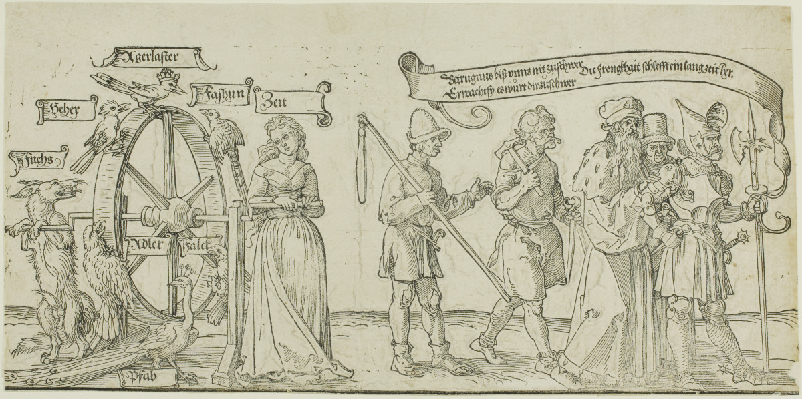

+++
menus = 'main'
title = 'Liste von Leid'
weight = 23
+++

# Liste von Leid

Die Welt ist unfair und ungerecht. Außerdem gefährlich.
Zusätzlich fügen sich Menschen gegenseitig Leid zu;
vor allem von denen, die privilegiert sind und Macht haben, gegenüber Schwächeren.

Wenn sich Menschen mit den antinatalistischen Schlüssen in der Diskussion auseinandersetzen,
ist oftmals zu beobachten, dass sich die Welt schön geredet wird.
Auch wird gesagt, andereswo in der Welt sei es schlecht, aber doch nicht hier in Deutschland.

Als Erinnerung, wo - auch in Deutschland - alltäglich Leid präsent ist,
haben wir hier eine Auswahl von Leid und Ungerechtigkeiten zusammengestellt.
Leid, das es gar nicht erst hätte geben sollen.

## Menschen an Menschen, direkt

### Missbrauch

* [Missbrauch von Kindern](https://de.wikipedia.org/wiki/Sexueller_Missbrauch_von_Kindern),
    "Die Täter sind Erwachsene, aber auch Jugendliche oder andere Kinder, nicht immer, aber überwiegend männlichen Geschlechts und oft aus dem sozialen Nahraum des Kindes."

### Hass gegen Frauen

* "Der alltägliche Mordversuch: Gewalt gegen Frauen | DokThema | Doku | BR"
    

* "Feinbild Frau arte Dokumentation", von Ursula Duplantier", 2022, 50 min
    

### Ausländerfeindlichkeit

* [Ganz unten](https://de.wikipedia.org/wiki/Ganz_unten) - "international erfolgreiches Buch des Autors und Journalisten
    Günter Wallraff, das Menschenrechtsverletzungen und Ausländerfeindlichkeit in der Bundesrepublik Deutschland
    in den frühen 1980er Jahren darstellt

### Der europäische Rassismus: "Rottet die Bestien aus" {#a__europ_rassismus}

arte-Doku, 2022:

* Artikel: https://www.deutschlandfunkkultur.de/raoul-peck-rottet-die-bestien-aus-100.html, 8 min Audio
* Filmtipp: https://www.youtube.com/watch?v=Smoi1QJ95OM, 2 min
* Siehe auch [Bisons töten, um Menschen zu vertreiben]()

"Die verstörende Überheblichkeit der Ignoranz" des europäischen Rassismus:



### Ausbeutung für digitale Dienste

* ["Moritz Riesewieck: „Digitale Drecksarbeit“ Facebook vom Bösen erlösen"](https://www.deutschlandfunkkultur.de/moritz-riesewieck-digitale-drecksarbeit-facebook-vom-boesen-100.html), 2017

### Homophobie

* https://de.wikipedia.org/wiki/Homophobie

### Krieg

* [Kriege](https://de.wikipedia.org/wiki/Krieg)

    * ["Die letzten NS-Täter: Ohne Strafe, ohne Reue? | Doku"](https://www.youtube.com/watch?v=RLxQfPhUZME), NDR, 45 min

* [Vertreibungen](https://de.wikipedia.org/wiki/Vertreibung)

### Folter

* [Liste der Foltermethoden](https://de.wikipedia.org/wiki/Folterinstrument)

    * [Briefe gegen das Vergessen](https://www.amnesty.de/mitmachen/briefe-gegen-das-vergessen),
        "Gib Gefangenen Hoffnung, schreib einen Brief"

* [Julian Assange](https://de.wikipedia.org/wiki/Julian_Assange)

## Menschen an Menschen, systemisch

### Klimakatastrophe

* Klimakatastrophe und Klimaungerechtigkeit
    * Überschwemmungen
    * Dürre
    * Ernteausfälle
    * Flucht und Vertreibung

### Drogen: Nikotin

"Smoking is Awesome" von kurzgesagt, 10 min, 2024:


Kommentar zu diesem Video:
"This video started so positive and slowly turned into nightmare, but that's what smoking is."

### Drogen: Alkohol

...

### Drogen: Weitere

"Sehnsucht nach Rausch - Drogen und ihre Folgen", 2023, hr-fernsehen

"Vorsicht: Triggerwarnung. Der folgende Film thematisiert Medikamenten- und Drogensucht und ihre Folgen bis hin zum Suizid.
Anschauen auf eigene Verantwortung.
Welche gesellschaftlichen Folgen hat der allgegenwärtige Drogenkonsum?
Das haben die Reporterinnen Isabell Kramer und Daniela Möllenkamp recherchiert."



<!--         "Die Drogenhölle auf den Straßen Amerikas I Weltspiegel", 2024 -->

### Weitere

* Schokolade auf Kosten von Menschen (in ärmeren Ländern)

* Süßigkeiten auf Kosten von Tieren (durch Gelatine, Kuhmilch und Hühner-Eier)

## Menschen an Tieren

### Speziesismus

[Speziesismus](https://de.wikipedia.org/wiki/Speziesismus) "bezeichnet die moralische Diskriminierung von Lebewesen ausschließlich aufgrund ihrer Artzugehörigkeit."



### Bisons töten, um Menschen zu vertreiben {#a__bisons_toeten}

* https://www.fluter.de/native-americans-durch-bisonjagd-ausgerottet, 2019,
    "In kürzester Zeit töteten weiße Jäger Millionen Bisons und raubten so den nordamerikanischen Ureinwohnern die Lebensgrundlage."

* https://de.wikipedia.org/wiki/Amerikanischer_Bison#Bejagung_f%C3%BCr_Handel_mit_Bisonroben_(ab_1820)_und_Fleischversorgung_der_Bahnarbeiter_(ab_1860er),
    "Um 1830 begann jedoch die gezielte Ausrottung der Bisons durch die europäischstämmigen Siedler,
    zunächst noch vorrangig mit dem Ziel, den Bedarf der europäischstämmigen Siedler zu decken,
    zunehmend aber auch den Zweck verfolgend, den ihre Jagdgebiete verteidigenden Indianern ihre Lebensgrundlage
    (in Form von Lebensmitteln, Brennstoff, Kleidung und Zelten) zu entziehen."

* Siehe auch [Europäischer Rassismus]()
