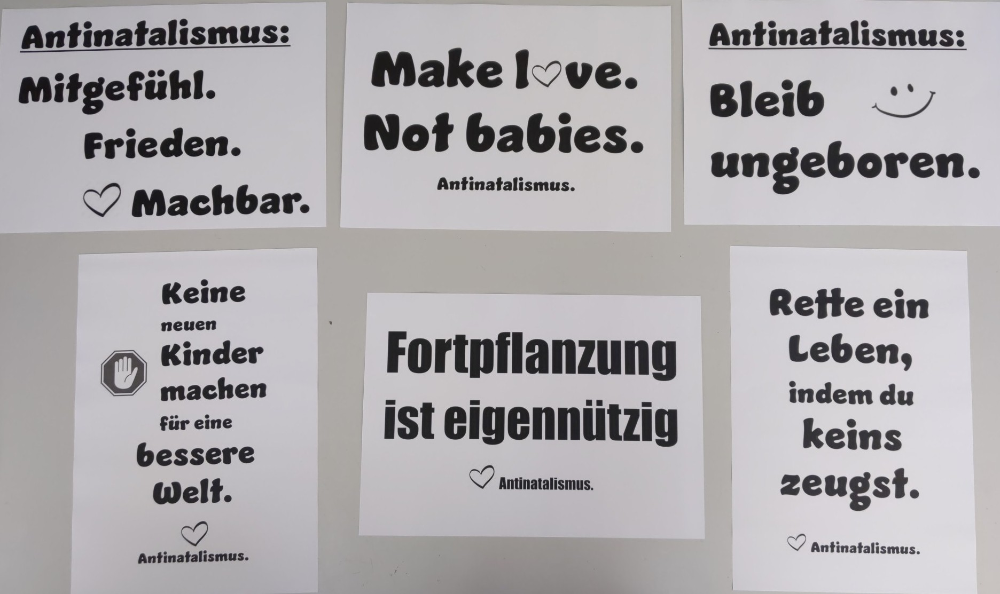
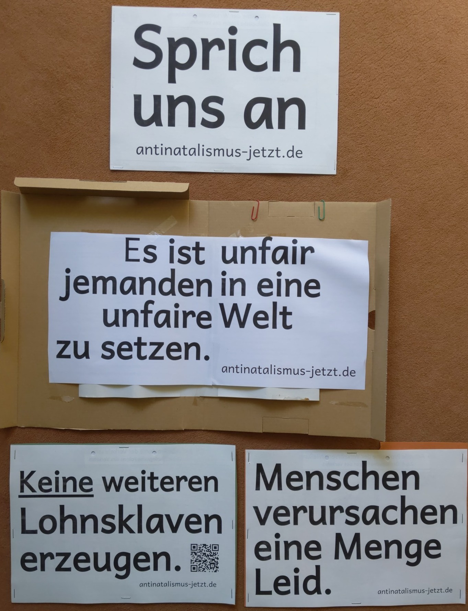

+++
menus = 'main'
title = 'Material'
weight = 25
type = 'docs'
#bookHidden = true
+++

# Material für Öffentlichkeitsarbeit

## 2024

Beispiel Ausdrucke auf A3-Papier, 20 Cent / Ausdruck.

Alle Ideen und Downloads für Straßenaktivismus sind frei verwendbar.

Siehe auch [Europa-Tour 2024](../europa-tour-2024).

Weitere Ausdrucke.

## Text-Ideen

Rational:

* **Fortpflanzung ist eigennützig.** ([Download](#downloads1))

* **Es ist unfair, jemanden in eine unfaire Welt zu setzen.** ([Download](#downloads2))

* **Menschen verursachen eine Menge Leid.** ([Download](#downloads2))

* **Dürfen wir neues Leben schaffen, um _unsere_ Lebensqualität zu verbessern?** ([Beispiel]())

* **Kriege werden enden, wenn Fortpflanzung endet.** / Kriege enden, wenn Fortpflanzung endet.

* **Keine Fortpflanzung. => Keine Kriege.**

* **Das Leben ist nicht fair.** / Mach kein neues.

* **Warum sollten wir zukünftige Generationen Kämpfen aussetzen, die wirklich nie enden?**

* **Antinatalismus: Mitgefühl. Frieden. Machbar.** ([Download](#downloads1))

* **Keine neuen Kinder machen für eine bessere Welt.** ([Download](#downloads1))

* **Es ist nicht dein Recht, jemanden in die Welt zu holen, der das nicht wollte.**

* **Ist Kinder zeugen eine persönliche Entscheidung?**

Nachdenklich / Humoristisch / Provokativ:

* **Rette ein Leben, indem du keins zeugst.** ([Download](#downloads1))

* **Make love, not babies.** ([Download](#downloads1))

* **Erzeuge keine weiteren Lohnsklaven.** ([Download](#downloads2))

* **Antinatalismus: Bleib ungeboren.** ([Download](#downloads1))

* **Niemand hat zugestimmt, gezeugt zu werden.**

* **Vasektomie für starke Männer.**

* **Männer in die Verantwortung. Für freien Zugang zur Vasektomie.**

* **Warum brauchst du jemand, der so aussieht wie du, um ihn zu lieben**

* **Keine Menschen. Keine Kriege.**

Hilfsmittel:

* **Sprich uns an!** ([Download](#downloads2))

## Downloads 1 {#downloads1}








## Downloads 2 {#downloads2}










## Bilder

* [Visualize Voluntary Human Extinction]()

## Kompakte Fakten-Templates

Zusammenstellung aus:

* [Was ist Antinatalismus?]()
* [Antinatalismus-Ressourcen]()
* [Antinatalistische Argumente]()
* [Pronatalistische Ausreden 😇]()
* [Häufige Fragen (FAQ)]()

### Zur Freude/Leid-Asymmetrie


Vielleicht mal anders gefragt:
Wenn du zwei Optionen hast:
a) eine nur hypothetische Freude, die nicht realisiert wird, weil keine Person geschaffen wird, oder
b) real existierendes Leid einer echten Person.
Was ist besser: a) oder b)?


### "Die Zeiten waren nie besser, vor allem in Deutschland"

Ich stimme dir zu, dass sich einige Dinge in der Welt und hierzulande verbessert haben. Das Rauchverbot in Restaurants, etc.
Daneben gibt es auch Dinge, die sich verschlechtert haben oder einfach noch nicht gut genug sind:
Dazu zählen Homophobie, Hass gegen Frauen (https://youtu.be/LLNs3CmynPY),
Angst vor dem Zahnarzt (5 Millionen haben sogar panische Angst: https://www.zahnarzt-drseidel.de/angst-vorm-zahnarzt/),
Anzahl Suizide, Anzahl Waisenkinder, Alkoholmissbrauch,
"Fehltage wegen kranker Psyche erreichen neuen Höchststand" (2023, https://de.statista.com/infografik/18813/krankschreibungen-wegen-psychischer-erkrankungen-in-deutschland/),
Angst vor Jobverlust,
SINUS-Jugendstudie 2024: “Die 14- bis 17-Jährigen sind besorgter denn je”.


## Zitate aus religiösen Schriften

### Christentum / Die Bibel

* https://bible.knowing-jesus.com/Deutsch/Prediger/4/1
    * Prediger 4:1:
        "Ich wandte mich und sah alle, die Unrecht leiden unter der Sonne;
        und siehe, da waren Tränen derer, so Unrecht litten und hatten keinen Tröster;
        und die ihnen Unrecht taten, waren zu mächtig, daß sie keinen Tröster haben konnten."
    * 4:2: "Da lobte ich die Toten, die schon gestorben waren, mehr denn die Lebendigen, die noch das Leben hatten."
    * 4:3: "**Und der noch nicht ist, ist besser denn alle beide**, und des Bösen nicht inne wird, das unter der Sonne geschieht."

* https://bible.knowing-jesus.com/Deutsch/Hiob/3/11
    * Hiob 3:11:
        * "Warum bin ich nicht gestorben von Mutterleib an? Warum bin ich nicht umkommen, da ich aus dem Leibe kam?"
        * 3:12: "Warum hat man mich auf den Schoß gesetzet? Warum bin ich mit Brüsten gesäuget?"
        * 3:13: "So läge ich doch nun und wäre stille, schliefe und hätte Ruhe"
        * 3:16: "oder wie eine unzeitige Geburt verborgen und nichts wäre, wie die jungen Kinder, die das Licht nie gesehen haben."

* https://www.bible.com/de/bible/73/LUK.23.29-31.HFA
    * Lukas 23:29-31 SCH2000:
        "Denn siehe, es kommen Tage, da man sagen wird:
        Glückselig sind die Unfruchtbaren, und die Leiber,
        die nicht geboren, und die Brüste, die nicht gestillt haben!
        Dann wird man anfangen, zu den Bergen zu sagen: Fallt über uns!
        und zu den Hügeln: Bedeckt uns! Denn wenn man dies mit dem grünen Holz tut,
        was wird mit dem dürren geschehen?"
