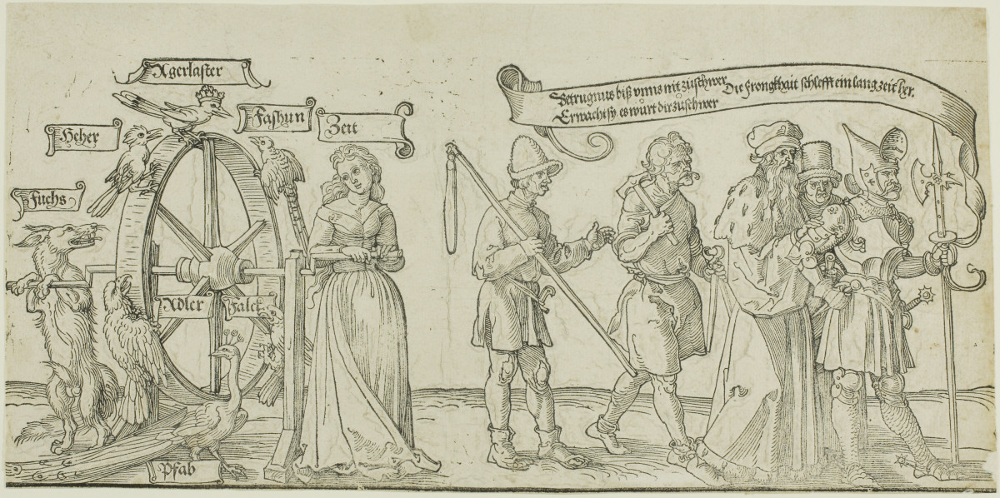

+++
menus = 'main'
title = 'Liste von Leid'
weight = 23
+++

# Liste von Leid

Neben der ersten Ungerechtigkeit, eine Person, die nicht zustimmen konnte,
in unsere **unfaire Welt** zu holen,
listen wir hier weitere Ungerechtigkeiten und anderes Leid auf,
die es gar nicht erst hätte geben sollen.

Sich dieses Leid zu vergegenwärtigen kann Gefühle von Schmerz und Ohnmacht hervorufen.
Wir ermutigen alle, ihre gefühlte Ohnmacht zu überwinden
und sich im Hier und Jetzt mindestens einem dieser Probleme zu widmen
und mitzuhelfen, das dahinterstehende Leid zu lindern.

## Gegenüber Menschen

### Krieg

* [Kriege](https://de.wikipedia.org/wiki/Krieg)

    * ["Die letzten NS-Täter: Ohne Strafe, ohne Reue? | Doku"](https://www.youtube.com/watch?v=RLxQfPhUZME), NDR, 45 min

* [Vertreibungen](https://de.wikipedia.org/wiki/Vertreibung)

### Folter

* [Liste der Foltermethoden](https://de.wikipedia.org/wiki/Folterinstrument)

    * [Briefe gegen das Vergessen](https://www.amnesty.de/mitmachen/briefe-gegen-das-vergessen),
        "Gib Gefangenen Hoffnung, schreib einen Brief"

* [Julian Assange](https://de.wikipedia.org/wiki/Julian_Assange)

### Missbrauch

* [Missbrauch von Kindern](https://de.wikipedia.org/wiki/Sexueller_Missbrauch_von_Kindern),
    "Die Täter sind Erwachsene, aber auch Jugendliche oder andere Kinder, nicht immer, aber überwiegend männlichen Geschlechts und oft aus dem sozialen Nahraum des Kindes."

### Hass gegen Frauen

* "Feindbild Frau | Doku HD Reupload | ARTE, von Ursula Duplantier", 2022, 50 min
    

### Ausbeutung für digitale Dienste

* ["Moritz Riesewieck: „Digitale Drecksarbeit“ Facebook vom Bösen erlösen"](https://www.deutschlandfunkkultur.de/moritz-riesewieck-digitale-drecksarbeit-facebook-vom-boesen-100.html), 2017

### Weitere

* Drogen
    

* Homophobie

* Klimaungerechtigkeit

* Schokolade auf Kosten von Menschen in armen Ländern

* Süßigkeiten auf Kosten von Tieren

* Etc.

## Gegenüber anderen Tieren

### Speziesismus

[Speziesismus](https://de.wikipedia.org/wiki/Speziesismus) "bezeichnet die moralische Diskriminierung von Lebewesen ausschließlich aufgrund ihrer Artzugehörigkeit."


